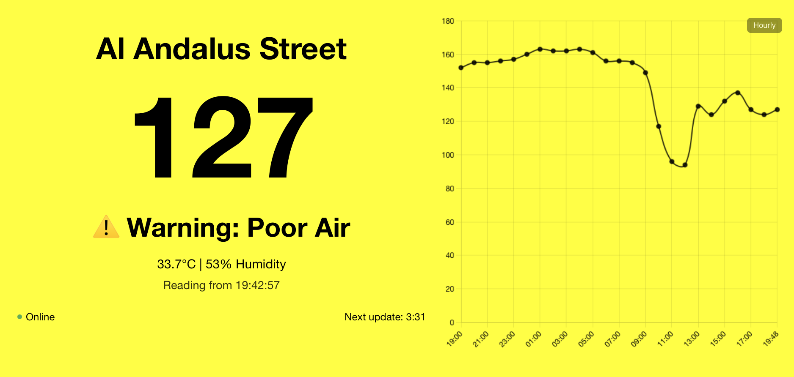

# AirVisual Dashboard Server

A lightweight web-based dashboard server for IQAir AirVisual air quality monitors.



## Features

* Responsive dashboard that works on any screen size
* Auto-switching background colors based on air quality level
* Historical AQI data in a configurable chart (hourly, daily, weekly)
* Works offline by caching data for when your device loses internet
* Simple configuration with a single JSON file
* Configurable via web interface on the log server
* Built-in logging system with web access

## Installation

### Server Installation

1. Clone this repository:
```bash
git clone https://github.com/yourusername/airvisual-dashboard-server.git
cd airvisual-dashboard-server
```

2. Run the setup script:
```bash
chmod +x setup.sh
./setup.sh
```

This will:
- Check for Node.js installation
- Set up the log server
- Create the appropriate service
- Start the service automatically

3. Configure your dashboard:
   - Visit the log server web interface at http://server-ip:8088
   - Edit your config.json file via the web interface
   - Click "Save Configuration"

4. Alternatively, you can edit config.json directly:
```bash
cp config.example.json config.json
nano config.json
```

### Manual Installation

1. Clone the repository
2. Install Node.js 20 LTS
3. Copy config.example.json to config.json and edit it with your settings
4. Run the log server: `node log-server.js`
5. Open the server URL in a browser: http://server-ip:8088

## Configuration

Your config.json file should contain:

```json
{
  "apiUrl": "https://device.iqair.com/v2/YOUR_DEVICE_ID",
  "location": "My Location",
  "refreshIntervalSec": 600
}
```

Replace `YOUR_DEVICE_ID` with your AirVisual device ID.

### Finding Your Device ID

1. Log in to your AirVisual account
2. Go to your dashboard
3. Click on your device
4. Look in the URL for a string like: `https://device.iqair.com/v2/xxxxxxxxxxxxxxxxxxxx`
5. The device ID is the string after `/v2/`

## Updating

To update the dashboard server to the latest version:

```bash
cd airvisual-dashboard-server
git pull
./setup.sh
```

## Management

- Access the dashboard and logs: http://server-ip:8088
- View/edit config: http://server-ip:8088

### Service Management

#### macOS:
- Start service: `launchctl load -w ~/Library/LaunchAgents/com.airvisual.logserver.plist`
- Stop service: `launchctl unload ~/Library/LaunchAgents/com.airvisual.logserver.plist`
- Restart service: `launchctl unload ~/Library/LaunchAgents/com.airvisual.logserver.plist && launchctl load -w ~/Library/LaunchAgents/com.airvisual.logserver.plist`

#### Linux (systemd):
- Start service: `sudo systemctl start airvisual-log-server.service`
- Stop service: `sudo systemctl stop airvisual-log-server.service`
- Restart service: `sudo systemctl restart airvisual-log-server.service`
- Check status: `sudo systemctl status airvisual-log-server.service`

## Client Setup

To display the dashboard, simply open a web browser on any device and navigate to:
```
http://server-ip:8088
```

## Troubleshooting

- **Dashboard not loading**: Check server status and logs
- **No data displayed**: Verify your device ID in config.json
- **Cannot access server**: Check server firewall settings and ensure port 8088 is open

## License

MIT License 
